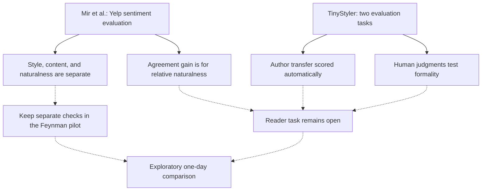

# How should we judge resemblance to Feynman?

Use separate checks and treat the one-day comparison as exploratory. Neither source establishes a reliable reader test for this project's outcome. This is an agent inference, not a result reported by either paper.

| Decision point | Mir et al. | TinyStyler | Implication and limit for the spec |
|---|---|---|---|
| What to measure | Distinguishes style intensity, content preservation, and naturalness (§2, pp. 495–496). | Distinguishes author metrics from meaning similarity; human formality evaluation is separate (§4.1–4.2). | Record resemblance, readability, and rejection checks separately. Applying these dimensions to technical explanations is an inference. |
| Whether paired judgments are reliable | Agreement improves for relative naturalness, not relative style intensity (§5.2, pp. 499–500). | Human study concerns formality (§4.2, pp. 13381–13382). | Neither establishes the proposed original-versus-generated author task. |
| What an automatic score establishes | Evaluates sentiment transfer on Yelp (§5, p. 498). | Evaluates Reddit author transfer with UAR author metrics and MIS similarity (§4.1; Table 2). | These settings do not measure recognition of Feynman's voice by our intended readers. |
| Whether to implement the paper's method | Studies three transfer models and evaluation methods (§5). | Uses reconstruction training and synthetic-transfer fine-tuning (§3). | Neither source selects an in-scope prompting method for this project. |
| Reader count and improvement threshold | Its three raters and 244 texts per aspect per model describe its own experiment (§5, p. 499). | Its evaluation addresses different populations and tasks (§4). | Counts and a threshold for this project remain open; copying a study's counts would not justify them. |

Passage records: [Mir et al.](../paper-sources/style-evaluation.md) and [TinyStyler](../paper-sources/tinystyler.md). More readable summaries: [evaluation page](style-evaluation.md) and [TinyStyler page](tinystyler.md).

Solid edges report source relationships. Dashed edges mark project inferences and untested applications.

## Decision and next evidence

The [spec decision](../project-spec.md#evaluation-decision-for-the-example) uses the existing three-case one-day scope. Reject factual errors, copied wording, and invented quotations or personal experiences. Record owner judgments of resemblance and readability separately. This does not demonstrate reader-level imitation.

Before a larger reader study, pilot the task and ask whether readers recognize originals and why they make their choices. Decide on sample sizes and a threshold before the main study. These are proposed next checks, not completed evidence.

## Check status

Every claim remains unchecked by the user. Agent factual and connection checks are in the [ledger](../evidence/agent-checks.md); [research notes](../paper-sources/notes.md#claim-checks) distinguish them from independent reading. The [answer draft](answer-draft.md) is a same-session rehearsal.
